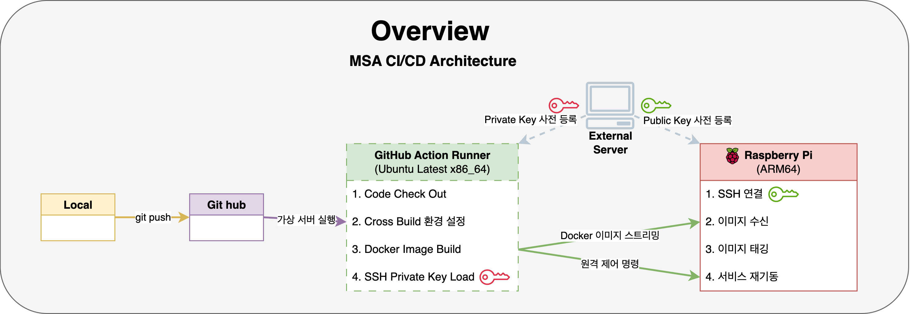

# MSA 인증 서버 : `dontgoback-auth-server`

# 1. 프로젝트 개요

### 소개

`dontgoback-auth-server`는 **서버 간 통신을 위한 인증 토큰 발급**과  
**JWT 검증용 공개키 제공**을 담당하는 마이크로서비스 인증 서버입니다.

이 프로젝트는 `DontGoBack` 마이크로서비스 아키텍처(MSA) 환경에서 공통 인증 인프라의 역할을 하며,  
Core 서버 및 기타 확장 서버들과의 신뢰 기반 통신을 위하여 **비대칭키(RS256) 기반**의 **JWT 발급 시스템**을 구현하였습니다.

- 인증 서버는 **개인키(private key)** 로 JWT를 서명하고,

- 확장 서버들에서는 **공개키(public key)** 만을 안전하게 제공하여 타 서비스가 JWT의 유효성을 검증할 수 있도록 합니다.

개발 및 배포는 **경량화된 인프라(Raspberry Pi)** 환경를 기반으로 하며, 단위테스트와 통합 테스트를 실행하고,  
Docker + GitHub Actions 기반 CI/CD 파이프라인을 구축하였습니다.

### 기간

- 2025.08.01 \~ (진행 중)

### 인원

- 개인 프로젝트

### 기술 스탭

|      번류      |            도구            |  버전  |
| :------------: | :------------------------: | :----: |
|      언어      |            Java            |   21   |
|    Backend     |        Spring Boot         | 3.4.0  |
|  인증/암호화   |        jjwt (RS256)        | 0.11.5 |
|     테스트     | JUnit5 / Mockito / MockMvc |  최신  |
| Infrastructure |        Raspberry Pi        |   -    |
|     DevOps     |  GitHub Actions / Docker   |   -    |

### 연관 프로젝트

- 코어 서버 GitHub 주소:
  [https://github.com/core](https://github.com/parkhongseok/projectDontGoBack)

- 확장 서버 GitHub 주소:
  [https://github.com/ext](https://github.com/parkhongseok/dontgoback-extension-server)

 
 
 

# 2. 주요 기능

### ① 비대칭키 기반 JWT 발급 API

- `POST /msa/auth/api/token`
- 등록된 `clientId`, `clientSecret` 검증 후 **개인키로 서명된 JWT** 발급
- 응답은 `Content-Type: text/plain` 으로 **JWT 문자열 그대로 반환**

 

### ② JWT 검증용 공개키 제공 API

- `/msa/auth/api/public-key`
- 응답은 `Content-Type: text/plain` 으로 **Base64 인코딩된 공개키**를 제공
- 타 서버는 이 키로 JWT 서명을 검증

 

### ③ 테스트 작성 및 검증

단위 테스트 + 통합 테스트를 모두 구성하여 안전성과 신뢰도를 확보했습니다.

#### 1) 단위 테스트

- 테스트 시에는 Spring Security 필터를 제거하고,
- **@WebMvcTest + @MockitoBean 조합**으로 단위 테스트 환경을 구성했습니다.
  | 컨트롤러 | 테스트 항목 |
  | -------------------------- | ---------------------------------------------------------------------- |
  | `ApiV1TokenController` | 유효한 클라이언트 요청 → JWT 발급 및 BASE64 인코딩 → `text/plain` 응답 |
  | | 잘못된 clientId or secret → 401 반환 |
  | `ApiV1PublicKeyController` | 공개키 초기화 실패 → 500 오류 반환 |
  | | 정상 요청 → 공개키 `text/plain` 응답 |

#### 2) 통합 테스트:

- 실제 PemKeyLoader, TokenProvider, TestTokenVerifier 를 통한 JWT 생성–검증 전체 흐름 검증

  > 테스트 전용 .yml 프로파일 분리

 

### ④ 빌드 및 배포 자동화

- Docker 기반 컨테이너화
- GitHub Actions 기반 CI/CD 자동화
- 빌드 캐시 통한 배포 시간 **501초에서 6초로 단축**

 

   

# 3. 아키텍처

## 3-1. 시스템 아키텍처

1. **dg-core-server** : 기존 기능(도메인 기능) 수행, 내부 서버 오케스트르레이션
2. **dg-auth-server** : S256 기반 JWT 발급·공개키 제공
3. **dg-extension-server** : 공개키로 검증 후 확장 API(유저 자산 갱신 등)를 제공

 
 

## 3-2. 네트워크 아키텍처

가정용 공유기 환경의 라즈베리파이를 외부 공개 서버로 구축한 아키텍처입니다.

- DDNS와 개인 도메인의 CNAME 레코드를 조합하여 유동적인 공인 IP 문제를 해결하고, DHCP 예약으로 내부 IP를 고정했습니다.

- 외부 요청은 포트포워딩을 통해 내부 서버로 전달되며, Let's Encrypt 인증서와 UFW 방화벽을 통해 HTTPS 기반의 이중 보안 계층을 확보했습니다.

 
 

## 3-3. 빌드 및 배포 자동화 아키텍처

- `git push`를 통해 MSA 애플리케이션을 라즈베리파이에 자동 배포하는 GitHub Actions 기반의 CI/CD 아키텍처입니다.

- 외부 컨테이너 레지스트리 없이, **SSH 스트리밍**으로 Docker 이미지를 서버에 직접 전송하여 배포 속도와 단순성을 확보했습니다.

- **ARM64 크로스 빌드**를 지원하며, GitHub Actions 캐시를 활용해 빌드 시간을 90% 이상 단축시켰습니다.  
  (최대 501초에서 6초로 단축)

- 또한, 배포 후 **자동 검증(Smoke Test)** 과 실패 시 로그 수집 기능으로 운영 안정성을 높였습니다.

 
 

더 자세한 기록은 [`docs/architecture/decisions`](./docs/architecture/decisions) 디렉터리에서 확인하실 수 있습니다.

 
 
